# Xian DIY 部品/BOM管理システム

電子工作・基板製作向けの部品管理、保管場所管理、製品BOM管理、QRラベル印刷をまとめて扱うためのPHP/MySQLアプリです。部品箱やチャック袋に貼るPhomemo M110S用QRラベルを作成し、QRから部品詳細ページへ移動できます。

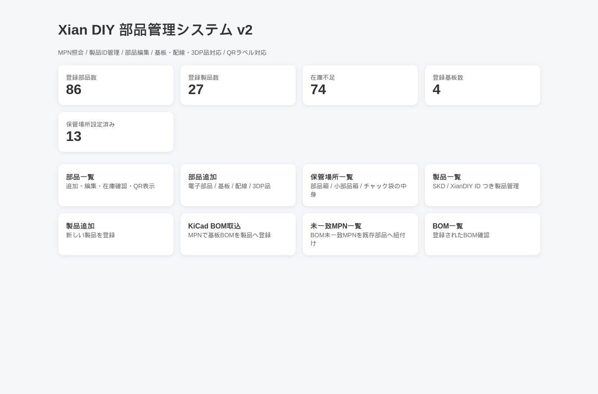

## できること

- 部品マスタ管理: 部品名、部品コード、MPN、メーカー、購入先、価格、在庫数、最低在庫、分類、タグ、保管場所を管理
- 自動分類: 部品名、MPN、メーカー、フットプリントから大分類・小分類・タグを自動補助
- 保管場所管理: 部品箱 `A`、小部品箱 `A1` から `A14`、チャック袋 `P001` のような保管体系を管理
- 複数保管場所: 1つの部品を `A1,A2,P001` のように複数場所へ登録
- QRラベル: Phomemo M110S 40x30mmラベル用の部品QRを表示・PNG生成、保管場所ページから選択部品を一括印刷
- A4ラベル印刷: 普通のインクジェットプリンター向けにA4シートへ複数部品ラベルを配置
- 製品管理: 製品名、Switch Science SKU、XianDIY ID、メモを管理
- 出荷ロットラベル: 出荷数ぶんのLot IDを連番作成し、Lot QRとmanual QRつきラベルを印刷
- 複数BOM: 1商品に複数基板や複数BOMグループを登録
- KiCad BOM取込: MPN列を持つKiCad CSVを取り込み、既存部品と照合
- 未一致MPN処理: BOM取込で一致しなかったMPNを既存部品へ紐付け
- 在庫確認: 製品ごとの必要数、作れる数、不足部品、概算原価を確認し、製作数ぶんの部品在庫を一括消費
- CSV出力: 製品詳細から構成部品や不足部品をCSV出力

## 前提

Docker Composeで起動する場合:

- Docker Desktop または Docker Engine
- Docker Compose v2

Docker Composeで起動する場合、PHP、Apache、MariaDB、Python QR生成ライブラリはコンテナ内に入るため、個別インストールは不要です。

通常のPHP/MySQLサーバーへ配置する場合:

- PHP 8+
- MySQL / MariaDB
- Python 3
- Pythonライブラリ: `qrcode`, `Pillow`
- QRラベル印刷を使う場合: CUPS、Phomemo M110Sプリンタ

通常配置でPythonライブラリが未導入の場合は、環境に合わせてインストールしてください。

```bash
pip install qrcode pillow
```

## セットアップ

### Docker Composeで起動

Docker DesktopまたはDocker Engineが使える環境では、次の手順で起動できます。

```bash
cp .env.example .env
docker compose up -d --build
```

ブラウザで開きます。

```text
http://localhost:8080
```

`.env` の `APP_PORT` を変えると公開ポートを変更できます。

```env
APP_PORT=8080
```

スマホでQRコードを読む場合は、スマホからアクセスできるURLを `.env` の `APP_BASE_URL` に設定してください。

```env
APP_BASE_URL=http://192.168.1.50:8080
```

Docker版は初回起動時に `schema.sql` をMariaDBへ自動投入します。部品データは空の状態で始まります。

`schema.sql` を修正したあとに既存のDocker DBを作り直す場合は、DBボリュームを削除してから再起動します。

```bash
docker compose down -v
docker compose up -d --build
```

停止:

```bash
docker compose down
```

DBデータも含めて完全に削除:

```bash
docker compose down -v
```

バックアップ例:

```bash
docker compose exec db mariadb-dump -u root -p xian_parts_v2 > backup.sql
```

復元例:

```bash
docker compose exec -T db mariadb -u root -p xian_parts_v2 < backup.sql
```

### Dockerが未インストールの場合

Windows / macOSでは、Docker Desktopをインストールするのが一番簡単です。

- Docker Desktop: https://www.docker.com/products/docker-desktop/

インストール後、ターミナルで次を確認します。

```bash
docker --version
docker compose version
```

LinuxではDocker EngineとDocker Compose pluginをインストールします。Ubuntu / Linux Mint系の例:

```bash
sudo apt-get update
sudo apt-get install -y ca-certificates curl
sudo install -m 0755 -d /etc/apt/keyrings
sudo curl -fsSL https://download.docker.com/linux/ubuntu/gpg -o /etc/apt/keyrings/docker.asc
sudo chmod a+r /etc/apt/keyrings/docker.asc

cat <<EOF | sudo tee /etc/apt/sources.list.d/docker.sources >/dev/null
Types: deb
URIs: https://download.docker.com/linux/ubuntu
Suites: $(. /etc/os-release && echo "${UBUNTU_CODENAME:-$VERSION_CODENAME}")
Components: stable
Architectures: $(dpkg --print-architecture)
Signed-By: /etc/apt/keyrings/docker.asc
EOF

sudo apt-get update
sudo apt-get install -y docker-ce docker-ce-cli containerd.io docker-buildx-plugin docker-compose-plugin
sudo systemctl enable --now docker
```

一般ユーザーで `docker` コマンドを使いたい場合:

```bash
sudo usermod -aG docker "$USER"
```

設定反映にはログアウト/ログイン、または次の実行が必要です。

```bash
newgrp docker
```

確認:

```bash
docker --version
docker compose version
docker run hello-world
```

### 通常のPHP/MySQLサーバーへ配置

1. MySQLで `schema.sql` を実行します。
2. `config.sample.php` を `config.php` にコピーします。
3. `config.php` のDB接続情報を自分の環境に合わせて変更します。
4. アプリ一式をPHPが動くWebサーバーへ配置します。
5. ブラウザで `index.php` を開きます。

公開版は空のDBから始める構成です。サンプル部品データは同梱していません。

ローカル確認だけなら、プロジェクトディレクトリでPHP内蔵サーバーを起動できます。

```bash
php -S 127.0.0.1:8099
```

その後、次のURLを開きます。

```text
http://127.0.0.1:8099/index.php
```

## 基本画面

`index.php` がダッシュボードです。登録部品数、登録製品数、在庫不足数、登録基板数、保管場所設定済み数を確認できます。各機能への入口もここに並びます。
各ページにはダッシュボードへ戻るリンクがあります。

主な画面:

- `parts.php`: 部品一覧
- `part_form.php`: 部品追加・編集
- `part_label_sheet.php`: 部品QRラベル一括印刷
- `storage_locations.php`: 保管場所一覧
- `products.php`: 製品一覧
- `product_form.php`: 製品追加・編集
- `product_lot_labels.php`: 出荷ロットラベル作成・印刷
- `product_detail.php`: 製品詳細、在庫確認、不足確認
- `product_bom.php`: 製品構成編集
- `bom_import.php`: KiCad BOM取込
- `unmatched_mpn.php`: 未一致MPN一覧
- `part_qr.php`: 部品QRラベル

## 部品管理

`parts.php` では、部品の検索、分類絞り込み、在庫不足のみ表示、詳細表示、編集、QRラベル表示ができます。

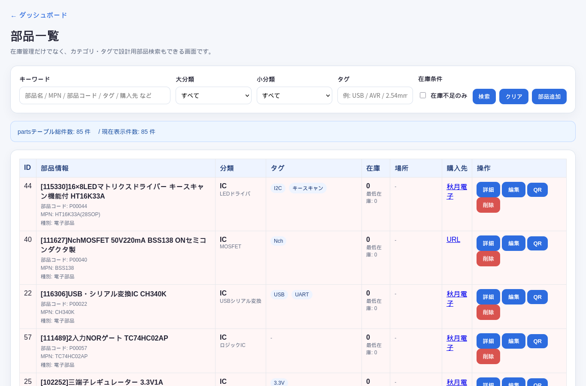

部品追加は `part_form.php` から行います。部品名、MPN、メーカー、仕入先品番、分類、タグ、在庫数、最低在庫、単価、保管場所、購入URLなどを入力できます。

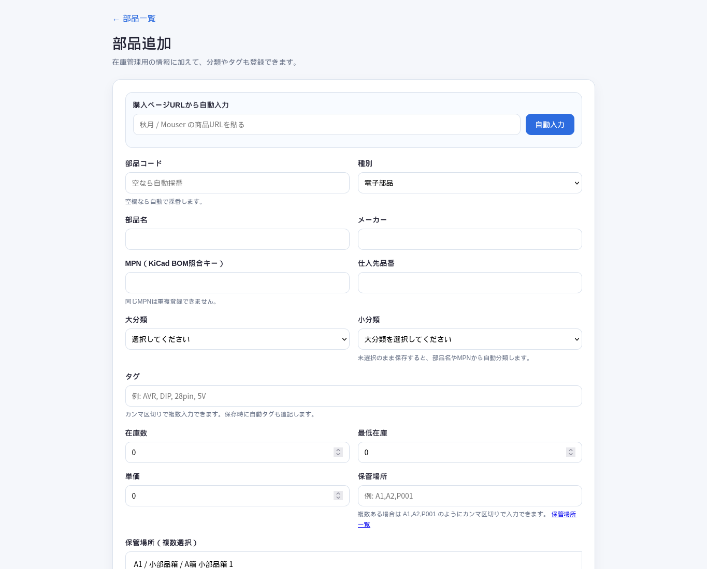

入力のポイント:

- `部品名` は必須です。
- `部品コード` は空欄なら自動採番されます。
- `MPN` はKiCad BOM照合キーとして使います。同じMPNは重複登録できません。
- `大分類` と `小分類` は手動選択できます。未選択の場合は保存時に自動分類されます。
- `タグ` はカンマ区切りで複数入力できます。
- `保管場所` は `A1,A2,P001` のようにカンマ区切りで複数入力できます。
- 保管場所がすでに別部品で使われている場合は警告が表示されます。
- 購入ページURLから自動入力できる欄もあります。

保存後は、保存した部品のQRラベル画面へ自動移動します。部品箱へ貼るラベルをすぐ印刷できます。

## 保管場所管理

`storage_locations.php` では、部品箱、小部品箱、チャック袋と、その中に入っている部品を確認できます。

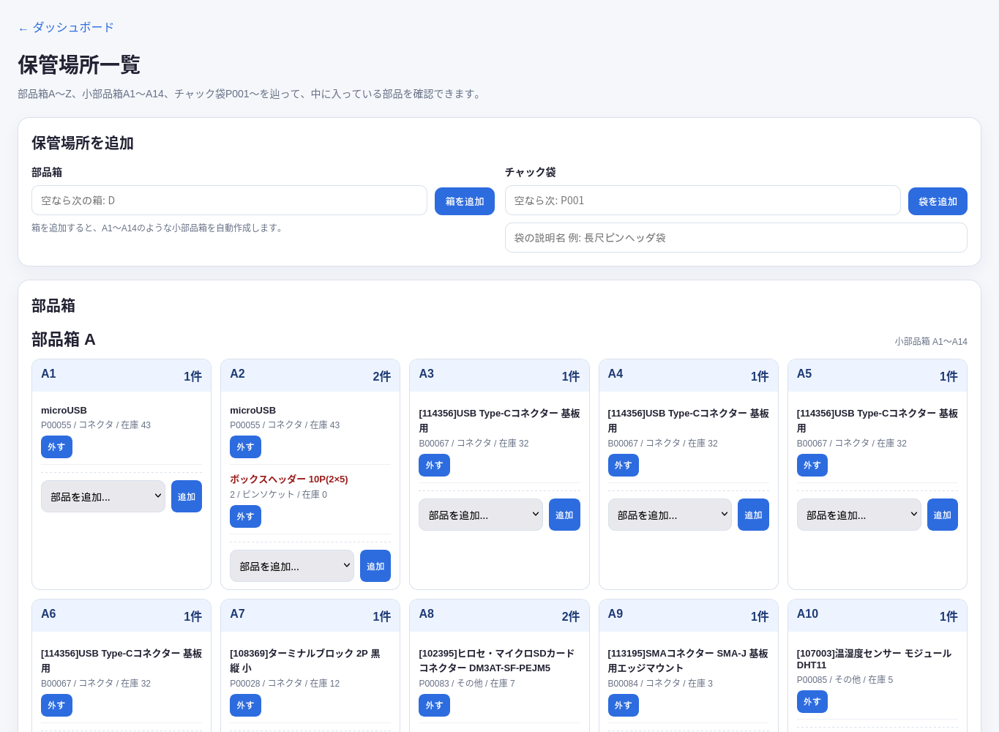

保管場所の考え方:

- 部品箱は `A`, `B`, `C` のようにアルファベットで管理します。
- 1つの部品箱には小部品箱が14個あり、`A1` から `A14` のように管理します。
- 小部品箱に入らない部品はチャック袋として `P001`, `P002` のように別系統で管理します。
- 1つの部品が複数の場所にある場合は、部品フォームで `A1,A2,P001` のように登録します。
- 保管場所一覧からも、場所に入っている部品の追加・解除ができます。
- 保管場所一覧で部品をチェックすると、選択した部品のQRラベルをまとめて印刷できます。
- 印刷形式はPhomemo M110S用の40x30mm連続印刷と、普通のインクジェットプリンター向けA4シートを選べます。

一括印刷は `part_label_sheet.php` で表示します。

- `mode=m110s`: Phomemo M110S 40x30mmラベルを1枚ずつ印刷
- `mode=a4`: 普通のインクジェットプリンター向けにA4紙へ複数ラベルを配置

## QRラベル

`part_qr.php?id=部品ID` でPhomemo M110S向けの40x30mm QRラベルを表示できます。

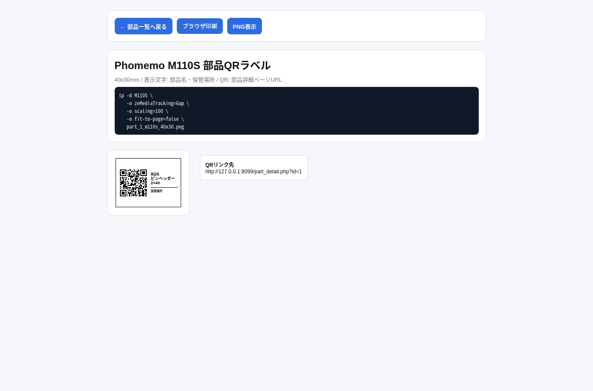

ラベル仕様:

- ラベルサイズ: 40x30mm
- 表示文字: 部品名、保管場所
- QR内容: 部品詳細ページURL
- QR画像: ローカル生成
- M110S向けPNG: ローカル生成
- 部品名や保管場所が長い場合は、ラベル内に収まるよう文字サイズを自動調整
- 印刷時は、画面上の保存メッセージや警告は非表示

PNGは次のURLで取得できます。

```text
part_qr.php?id=部品ID&format=png
```

QRコード単体画像は次のURLで取得できます。

```text
part_qr.php?id=部品ID&format=qr
```

CUPSでPhomemo M110Sへ印刷する例:

```bash
lp -d M110S \
   -o zeMediaTracking=Gap \
   -o scaling=100 \
   -o fit-to-page=false \
   part_1_m110s_40x30.png
```

QRに埋め込むURLを固定したい場合は、`config.php` に `APP_BASE_URL` を定義します。

```php
define('APP_BASE_URL', 'http://192.168.0.10/xian_inventory_app');
```

## 製品管理

`products.php` では、製品の検索、登録、編集、詳細表示、構成編集へ移動できます。

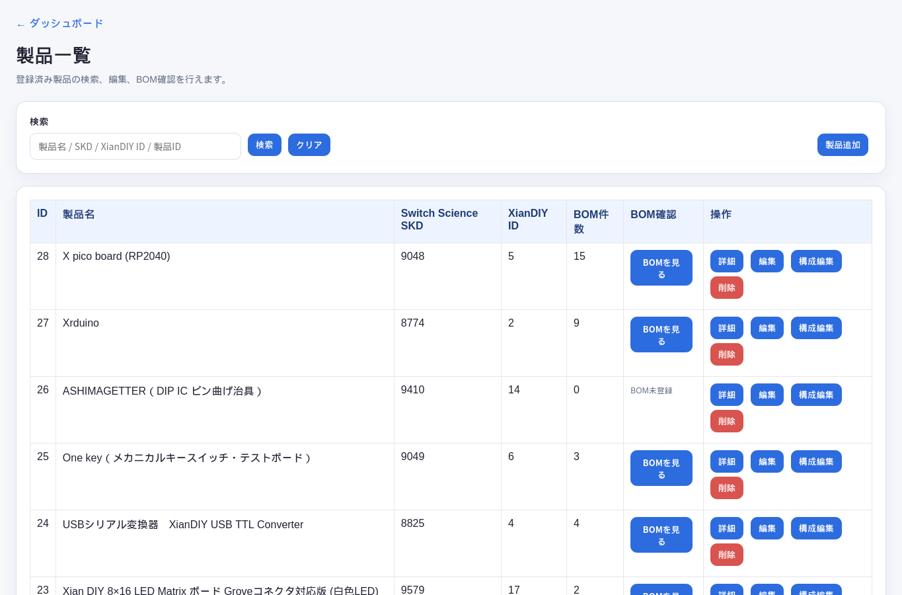

`product_form.php` では、製品名、Switch Science SKU、XianDIY ID、メモを登録します。

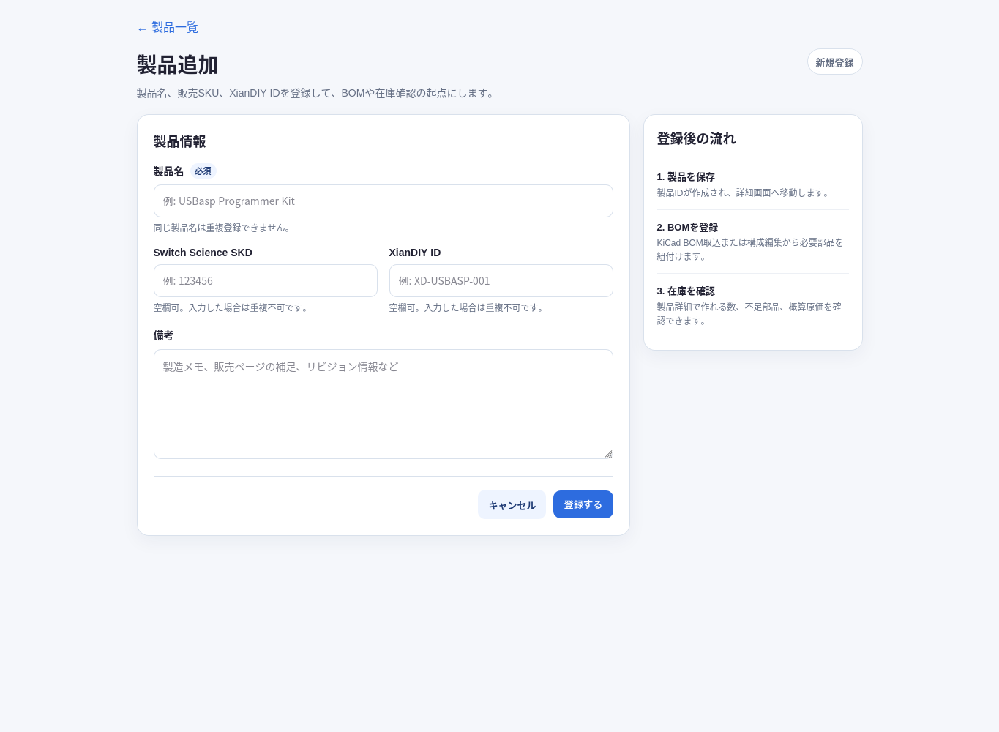

製品登録後は `product_detail.php` で、製品に必要な部品、BOMグループ、在庫状況、作れる数、不足部品、概算原価を確認できます。

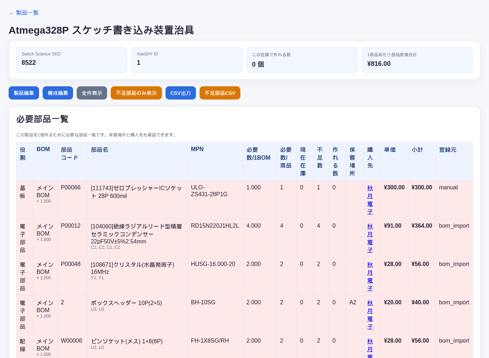

製品詳細でできること:

- 製品情報の確認
- BOMグループ別の必要部品確認
- 在庫から作れる数の確認
- 不足部品のみ表示
- 構成部品CSV出力
- 不足部品CSV出力
- 製品編集、構成編集へ移動
- 製作数を入力し、その商品を作る分だけ構成部品の在庫を一括で減算

## 出荷ロットラベル

`product_lot_labels.php` では、製品出荷時に貼る40x30mmラベルを作成できます。ラベルにはLot ID、Lot QR、manual QR、SKU、XianDIY ID、日付を印字します。

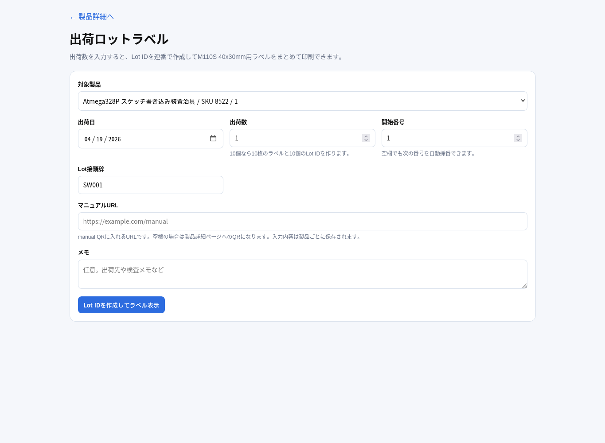

使い方:

- 製品を選択します。
- 出荷日と出荷数を入力します。
- Lot接頭辞は、XianDIY IDから `SW011` のように自動候補が入ります。
- 開始番号は、同じLot接頭辞・同じ月の次番号が自動で入ります。
- 10個出荷する場合は、出荷数に `10` と入力すると10枚分のLot IDを連番で作成します。
- manual QRに入れるマニュアルURLを入力します。URLは製品ごとに保存され、次回以降も再利用されます。
- 作成後に表示されるラベル画面で印刷します。

Lot IDは次の形式で作成します。

```text
SW011-04-005
```

意味:

- `SW011`: 製品ごとのLot接頭辞
- `04`: 出荷日の月
- `005`: 連番

Lot QRは `product_lot_detail.php` のロット詳細へリンクします。manual QRは入力したマニュアルURLへリンクします。

## 製品構成と複数BOM

`product_bom.php` では、1商品に複数のBOMグループを登録できます。複数基板で1商品になる場合は、メイン基板BOM、LED基板BOM、ケース部品BOMのように分けて登録します。

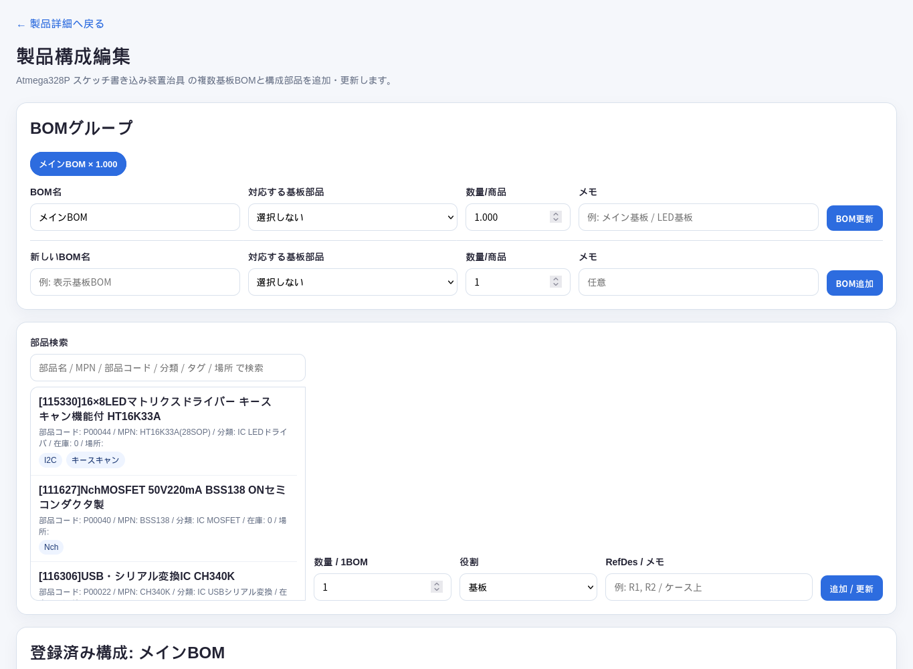

BOMグループで管理する項目:

- BOM名
- 対応する基板部品
- このBOMの数量 / 1商品
- メモ

構成部品で管理する項目:

- 部品
- 数量 / 1BOM
- 役割: 基板、電子部品、配線、3DP品、機構部品、その他
- Reference Designators

## KiCad BOM取込

`bom_import.php` では、KiCadから出力したBOM CSVを製品へ取り込めます。製品を選択し、取込先BOMグループを選び、CSVをドラッグ＆ドロップします。

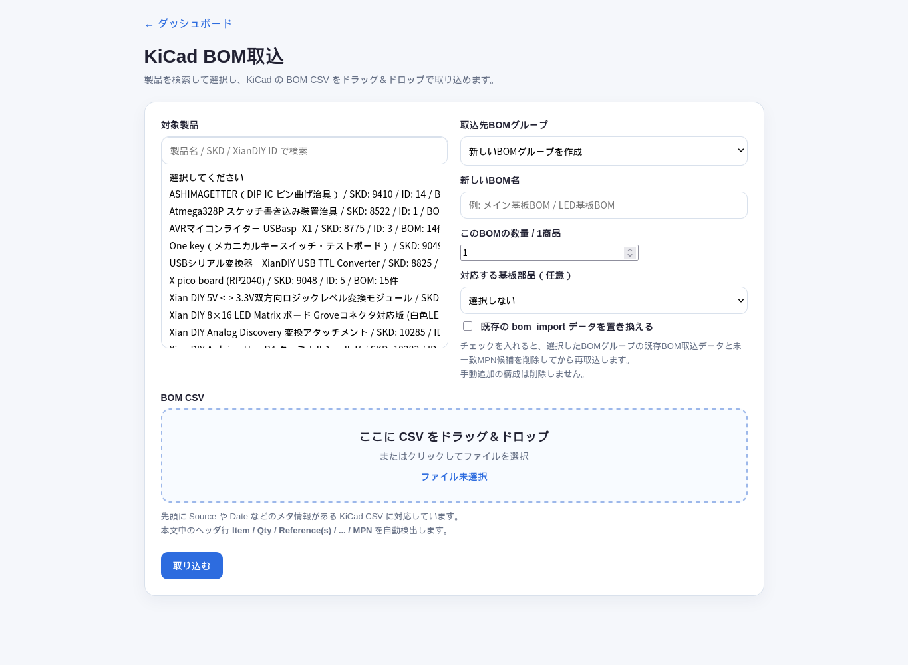

取込のポイント:

- CSVには `MPN` 列が必要です。
- `Item / Qty / Reference(s) / ... / MPN` のようなヘッダ行を自動検出します。
- 既存BOMグループへ取り込むことも、新しいBOMグループを作ることもできます。
- `既存のbom_importデータを置き換える` を使うと、選択BOMグループの取込済みデータを削除して再取込できます。
- MPNが既存部品に一致したものは `product_components` に登録されます。
- 一致しなかったものは未一致MPNとして残ります。

## 未一致MPN処理

`unmatched_mpn.php` では、BOM取込で部品マスタに見つからなかったMPNを、既存部品へ紐付けできます。

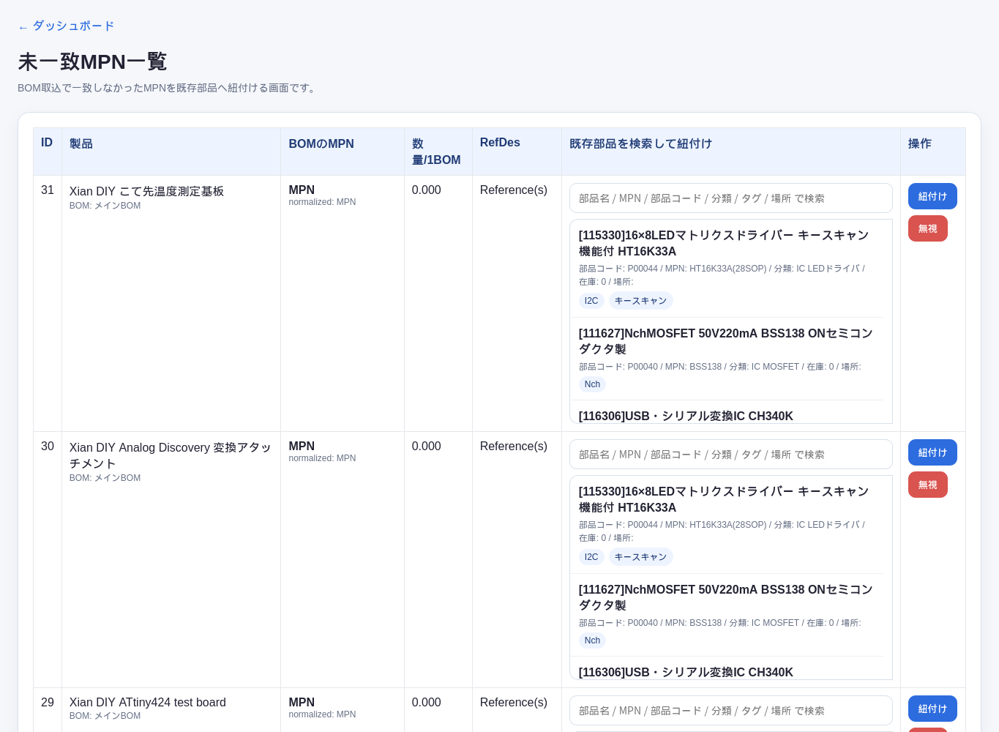

使い方:

- 未一致MPNごとに、部品名、MPN、部品コード、分類、タグ、場所で既存部品を検索します。
- 該当部品を選んで解決すると、製品構成へ反映されます。
- 不要な候補は無視できます。
- 未一致が多い場合は、先に部品マスタへMPN付きで部品登録すると後の取込が楽になります。

## 推奨運用フロー

1. 部品を登録します。
2. 保管場所を `A1,A2,P001` のように登録します。
3. 保存後に表示されるQRラベルを印刷し、部品箱やチャック袋へ貼ります。
4. 製品を登録します。
5. KiCad BOM CSVを取り込みます。
6. 未一致MPNがあれば、既存部品へ紐付けるか、新規部品として登録します。
7. 製品詳細で不足部品や作れる数を確認します。
8. 出荷時は出荷ロットラベルで出荷数ぶんのLot IDを作成し、商品へ貼ります。
9. 必要に応じて不足部品CSVを出力し、発注や棚卸しに使います。

## システム構成

主要ファイル:

- `index.php`: ダッシュボード
- `config.php`: DB接続情報、APIキー、任意の `APP_BASE_URL`
- `config.sample.php`: 共有用設定サンプル
- `config.docker.php`: Docker版で使う環境変数対応設定
- `.env.example`: Docker Compose用の設定サンプル
- `Dockerfile`: PHP/Apacheアプリコンテナ定義
- `docker-compose.yml`: アプリとMariaDBを起動するCompose定義
- `docker/`: Apache/PHP設定
- `schema.sql`: 初期DBスキーマ
- `parts.php`: 部品一覧
- `part_form.php`: 部品追加・編集
- `part_detail.php`: 部品詳細
- `part_qr.php`: QRラベル画面、QR画像、M110S PNG出力
- `part_label_sheet.php`: 部品QRラベル一括印刷、A4印刷
- `part_taxonomy.php`: 部品分類、自動分類ルール
- `storage_schema.php`: 保管場所テーブルの作成・補助関数
- `storage_locations.php`: 保管場所一覧、部品割当
- `products.php`: 製品一覧
- `product_form.php`: 製品追加・編集
- `product_detail.php`: 製品詳細、在庫計算、CSV出力
- `product_lot_schema.php`: 出荷ロット、製品別ラベル設定テーブルの作成・補助関数
- `product_lot_labels.php`: 出荷ロットラベル作成・印刷
- `product_lot_detail.php`: 出荷ロット詳細
- `product_lot_qr.php`: Lot QR、manual QR画像出力
- `product_bom.php`: 製品構成編集、複数BOM管理
- `product_bom_schema.php`: 複数BOM用テーブル作成・移行
- `bom_import.php`: KiCad BOM CSV取込
- `unmatched_mpn.php`: 未一致MPN解決
- `tools/m110s_label_png.py`: QR画像、M110S用1bit PNG生成
- `tools/classify_parts.php`: 既存部品の分類更新ツール
- `docs/images/`: README用スクリーンショット

主要テーブル:

- `parts`: 部品マスタ
- `products`: 製品マスタ
- `product_label_settings`: 製品ごとのLot接頭辞、マニュアルURL
- `product_lots`: 出荷ロット、Lot ID、出荷日、ラベルバッチ
- `product_boms`: 製品ごとのBOMグループ
- `product_components`: BOM内の構成部品
- `unmatched_bom_items`: BOM取込時に既存部品へ一致しなかったMPN
- `storage_locations`: 部品箱、小部品箱、チャック袋などの保管場所
- `part_storage_locations`: 部品と保管場所の多対多対応

## スクリーンショット更新

README用画像は `docs/images/` に保存しています。ローカルサーバーを起動して、Firefox headlessで撮影できます。

```bash
php -S 127.0.0.1:8099
```

別ターミナルで例:

```bash
firefox --headless --window-size=1365,900 --screenshot docs/images/dashboard.png http://127.0.0.1:8099/index.php
firefox --headless --window-size=1365,900 --screenshot docs/images/parts-list.png http://127.0.0.1:8099/parts.php
firefox --headless --window-size=1365,1100 --screenshot docs/images/part-form.png http://127.0.0.1:8099/part_form.php
firefox --headless --window-size=1365,1000 --screenshot docs/images/storage-locations.png http://127.0.0.1:8099/storage_locations.php
firefox --headless --window-size=1365,900 --screenshot docs/images/products-list.png http://127.0.0.1:8099/products.php
firefox --headless --window-size=1365,1000 --screenshot docs/images/product-form.png http://127.0.0.1:8099/product_form.php
firefox --headless --window-size=1365,1000 --screenshot docs/images/product-detail.png http://127.0.0.1:8099/product_detail.php?id=1
firefox --headless --window-size=1365,1000 --screenshot docs/images/product-lot-labels.png http://127.0.0.1:8099/product_lot_labels.php?product_id=1
firefox --headless --window-size=1365,1000 --screenshot docs/images/product-bom.png http://127.0.0.1:8099/product_bom.php?product_id=1
firefox --headless --window-size=1365,1000 --screenshot docs/images/bom-import.png http://127.0.0.1:8099/bom_import.php
firefox --headless --window-size=1365,1000 --screenshot docs/images/unmatched-mpn.png http://127.0.0.1:8099/unmatched_mpn.php
firefox --headless --window-size=1365,900 --screenshot docs/images/qr-label.png http://127.0.0.1:8099/part_qr.php?id=1
```

## Git管理について

- `config.php` はDBパスワードやAPIキーを含むため、Git管理対象外です。
- 公開用・共有用には `config.sample.php` を使います。
- GitHubへ公開する場合も、実運用のパスワード、APIキー、アクセストークンはコミットしないでください。

## 注意

- KiCad BOMは `MPN` 列があるCSVを前提にしています。
- MPNが空の部品は自動照合できないため、部品マスタにはできるだけMPNを登録してください。
- QRコードのリンク先をスマホから開く場合、スマホがアクセスできるURLを `APP_BASE_URL` に設定してください。
- `schema.sql` は初期構築用です。既存DBへ後から機能追加する場合は、アプリ内の `storage_schema.php` や `product_bom_schema.php` が必要なテーブルを補います。
